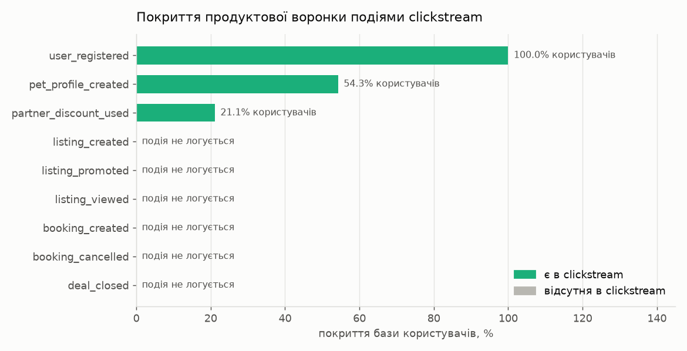
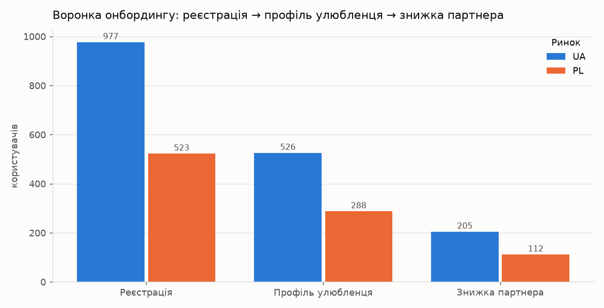
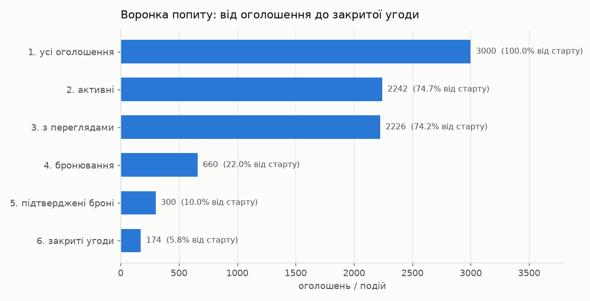
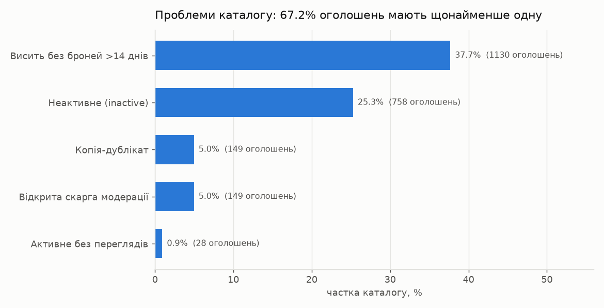
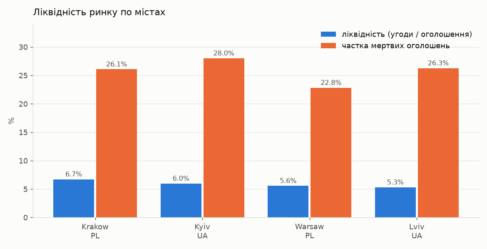
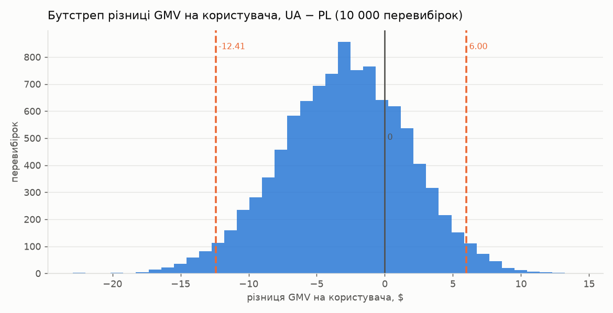

# Pet&Market — analytical report

Pet&Market is a marketplace for pet goods and services. It operates in two countries: Ukraine (Kyiv, Lviv) and Poland (Warsaw, Krakow). People here both sell and buy from each other.

The product works like this. A person registers, fills in a pet profile and gets partner discounts — that is the onboarding. After that they can post a listing in one of three categories, or book someone else's listing and take that booking through to a deal. The marketplace takes no percentage of the deal. It earns on paid listing promotion and on a $2.50 fee per booking.

The data sits in 11 PostgreSQL tables:

| Group | Tables |
|---|---|
| Reference data | `cities`, `categories` |
| People | `users`, `user_profiles`, `partner_discounts` |
| Listings and deals | `listings`, `listing_promotions`, `view_bookings`, `deals` |
| Logs | `clickstream_events`, `listing_moderation_logs` |

The calculations are split between two files. `main.py` computes funnels, segments and statistical checks in pandas. `marketplace.sql` handles the tracking audit, catalog scoring and city-level cuts directly in the database.

A warning up front. The data is synthetic, and there are almost no relationships between the tables in it. There is a separate section 7 about this. So the numbers below show that the analytics works correctly, not how a real market behaves.

---

## 1. What we can actually see in the data

Why this matters. Before counting conversions, you need to know which user actions the product records. Otherwise it is easy to compute a funnel over the events that exist and fail to notice that all the money happens where there are no records at all.

The events table has exactly three types, and all three are about onboarding.

| Event | Records | Users | Coverage of the base |
|---|---|---|---|
| `user_registered` | 1500 | 1500 | 100 % |
| `pet_profile_created` | 814 | 814 | 54.27 % |
| `partner_discount_used` | 317 | 317 | 21.13 % |

The registration event is present for all 1500 users. This is the first tracking check, because that event is exactly what sits in the denominator of any funnel.

After that it is empty. Out of the nine steps that would be worth recording, six are not recorded: creating a listing, buying promotion, a view, a booking, cancelling a booking and closing a deal. That means the entire money part of the product is missing from the logs, and sections 3–6 are computed not from events but from the deal tables.

This is important. The tables show the result, but not the path to it. We know a booking was cancelled, but we do not know when and after what.

Next — 13 checks on whether the logs agree with the tables. Twelve are clean: no events without a user, no duplicate registrations, no deals on cancelled bookings, chronology is nowhere violated. One is non-zero: five listings have bookings with zero views. You cannot book something you have not seen. So the view counter is filled in on its own and is not connected to the rest of the data.

Conclusion. Tracking covers onboarding and does not cover the money. Only section 2 can be shown to partners — there the events describe a real user path.

---

## 2. The onboarding funnel: registration → profile → discount

Why this matters. The pet profile is the entrance to the partner program: without it the discount is unavailable. Partners pay for access to pet owners, so it matters to us how many people reach that state.

| Market | Registration | Profile | CR to profile | Discount | CR profile → discount | End-to-end CR |
|---|---|---|---|---|---|---|
| UA | 977 | 526 | 53.84 % | 205 | 38.97 % | 20.98 % |
| PL | 523 | 288 | 55.07 % | 112 | 38.89 % | 21.41 % |

Both countries behave the same way. Roughly half of registrations reach a profile, and almost four out of ten profile owners take a discount. The difference between UA and PL is 1.2 points, z-score −0.455. Anything below 2 is ordinary random spread, so there is no difference.

317 people out of 1500 reach the partner offer, i.e. 21 % of the base. Of the 1183 lost, 686 drop off at the profile and 497 at the discount. The bigger reserve is in the profile.

Pet type gives a weak but noticeable signal: cats 44.51 %, birds 41.01 %, dogs 39.82 %, "other" 32.02 %. The 12.5-point gap is most likely not about animals. "Other" is the bucket for those who did not find themselves in the list, and the partner offer simply does not suit them. So the list of types should be extended, rather than drawing conclusions about cats.

And here is a check that calls the step itself into question:

| Has a pet profile | Became a buyer | Became a seller |
|---|---|---|
| No | 33.97 % | 86.73 % |
| Yes | 35.87 % | 85.38 % |

The profile changes nothing. Both differences are noise. It is useful to partners, but it does not make a person more active on the marketplace itself.

Conclusion. Onboarding is the same in both countries and loses the most at the profile. But there is no point requiring a profile from everyone: it has no effect on trading. Its place is a separate branch for those interested in discounts.

---

## 3. The demand funnel: from listing to deal

Why this matters. The money comes from the path listing → booking → deal. The bottom-line 5.8 % says liquidity is low, but does not say what to do. Broken down into steps, the path shows which stage eats the most.

| Step | Count | Transition from previous | From the start |
|---|---|---|---|
| 1. All listings | 3000 | — | 100 % |
| 2. Active | 2242 | 74.73 % | 74.73 % |
| 3. With views | 2226 | 99.29 % | 74.20 % |
| 4. Bookings | 660 | 29.65 % | 22.00 % |
| 5. Confirmed bookings | 300 | 45.45 % | 10.00 % |
| 6. Closed deals | 174 | 58.00 % | 5.80 % |

There are two holes.

The first is step 2: a quarter of the catalog is inactive before anyone could even see it. This is not about demand, it is about catalog quality. Section 4 is about that.

The second, and the main one, is step 5. 54.55 % of bookings get cancelled, that is 360 bookings out of 660. The person has already chosen a listing and paid the fee, and there will be no deal. The next step loses less: 58 % of confirmed bookings become deals. So people do not change their minds during the deal — the intent fades right after the booking.

Does paid promotion help? No.

| Group | Listings | Average views | CR to booking | Deals | Liquidity |
|---|---|---|---|---|---|
| Without promotion | 2600 | 56.0 | 22.08 % | 147 | 5.65 % |
| Paid promotion | 400 | 57.9 | 21.50 % | 27 | 6.75 % |

Promotion adds 1.9 views and adds no conversion at all. Meanwhile sellers paid $5,440 for it — that is 77 % of the marketplace's entire revenue. The product that brings in most of the money does not do what it promises.

Across categories the supply is almost identical, while demand is not:

| Category | Listings | Deals | Average price | CR listing → deal |
|---|---|---|---|---|
| Pet Services | 1007 | 72 | $253.52 | 7.15 % |
| Pets & Animals | 967 | 52 | $259.63 | 5.38 % |
| Pet Supplies | 1026 | 50 | $254.55 | 4.87 % |

Services sell one and a half times better than goods at the same price. This is the only cut in the report where the segments genuinely diverge.

Conclusion. The most expensive point is booking cancellations, not acquisition. To understand the cause you need timestamped events, which are not in the logs (section 1).

---

## 4. Catalog quality: duplicates and dead listings

Why this matters. Every dead or duplicated listing spoils the search results and at the same time lands in the denominator of the liquidity metrics. Because of this the market looks worse than it is.

The scoring assigns penalties to every listing: a copy by identical title (−40), `inactive` status (−25), active with no views (−20), an open complaint (−20), sitting for more than 14 days with no bookings (−15).

| Problem | Listings | Share of catalog |
|---|---|---|
| Sitting >14 days with no bookings | 1130 | 37.67 % |
| Inactive (`inactive`) | 758 | 25.27 % |
| Duplicate copy | 149 | 4.97 % |
| Open moderation complaint | 149 | 4.97 % |
| Active with no views | 28 | 0.93 % |
| Any of the problems | 2017 | 67.23 % |

Two thirds of the catalog has a flaw, but they are treated differently. The largest group is 1130 listings that simply sit there with no demand. This is a normal background level for a marketplace, they need to be boosted or moved to the archive. And the 758 inactive ones should not be in the search results at all.

Duplicates need care. There are 150 identical titles, but this is a single cluster: "Собака породы Лабрадор щенки", 144 different sellers, 97 copies active. One copy per seller — that is not a spam account. That kind of trace is left by a template or an import from another platform, and what needs cleaning up is the source, not individual cards.

The main number of this section is a different one — moderation does not see the duplicates:

| Group | Listings | Complaints | Share with a complaint |
|---|---|---|---|
| Duplicate copies | 149 | 15 | 10.07 % |
| The rest of the catalog | 2851 | 274 | 9.61 % |

A copy has exactly the same chance of getting a complaint as an ordinary listing. So complaints about duplicates are random. The complaint reasons are also distributed evenly, and roughly half of each type sits unresolved: WRONG_CATEGORY 55.3 %, DUPLICATE 57.4 %, IRRELEVANT 47.8 %, FRAUD_SUSPECT 46.1 %. Even a fraud suspicion waits as long as a wrong category.

Conclusion. Duplicates should be caught at publication: a single query on the normalized title finds the whole cluster, while the complaint queue finds 10 % of it — exactly as much as in the clean catalog. And the queue itself needs priorities by complaint type.

---

## 5. Market liquidity by city

Why this matters. Liquidity shows what share of what is listed finds a buyer. It is looked at by city, because a marketplace lives locally: a buyer from Lviv will not buy in Warsaw.

| City | Users | Listings | Dead | Deals | Liquidity | Median days to deal |
|---|---|---|---|---|---|---|
| Krakow (PL) | 264 | 491 | 26.07 % | 33 | 6.72 % | 4.0 |
| Kyiv (UA) | 501 | 1007 | 28.00 % | 60 | 5.96 % | 4.5 |
| Warsaw (PL) | 259 | 539 | 22.82 % | 30 | 5.57 % | 5.0 |
| Lviv (UA) | 476 | 963 | 26.27 % | 51 | 5.30 % | 5.0 |

It is tempting to read this as a ranking: Krakow is 27 % better than Lviv. It is not worth doing that. The difference between the first and the last city is 1.4 points, and it rests on 30–60 deals. A few random deals move a city across the whole list. The same with time to deal: medians of 4–5 days with an overall spread from 2 to 8.

What really is the same is the share of dead listings: 22.8–28.0 % in every city, 27.16 % across Ukraine against 24.37 % across Poland. The catalog problem from section 4 is evenly distributed across all markets.

A more useful cut is city together with category:

| City | Category | Listings | Deals | Liquidity |
|---|---|---|---|---|
| Warsaw | Pet Supplies | 171 | 6 | 3.51 % |
| Warsaw | Pets & Animals | 171 | 6 | 3.51 % |
| Lviv | Pet Supplies | 327 | 15 | 4.59 % |
| Krakow | Pet Services | 170 | 13 | 7.65 % |
| Warsaw | Pet Services | 197 | 18 | 9.14 % |

Warsaw is simultaneously the worst on goods (3.51 %) and the best on services (9.14 %). A 2.6× difference within one city. That is why the Warsaw average (5.57 %) describes neither of its halves.

Conclusion. The cities are the same, the categories are not. You cannot decide a market's fate on these numbers, the difference is within the noise. But you can strengthen services and deal with goods: that effect is visible in every cut.

---

## 6. UA vs PL after the expansion

Why this matters. Poland is a new market. The question about it is simple: does it behave like the Ukrainian one or not. If it does, Ukrainian decisions carry over there unchanged.

| Market | Users | Listings | Deals | CR listing → deal | GMV | Average check | GMV per user |
|---|---|---|---|---|---|---|---|
| UA | 977 | 1970 | 111 | 5.63 % | $23,318.55 | $210.08 | $23.87 |
| PL | 523 | 1030 | 63 | 6.12 % | $14,065.99 | $223.27 | $26.89 |

Poland looks slightly better on every metric. It is tempting to say the market is more promising. But the $3 per user difference rests on 63 deals, so it needs checking.

The check is a bootstrap. The same metric is recomputed on 10,000 random resamples of the same audience, and we look at the range it wanders in. An important detail: GMV is computed across all users, including those who sold nothing. If you take only sellers with deals, the average shoots up and the comparison is ruined.

The 95 % interval for the GMV per user difference (UA − PL): from −12.41 to +6.00. Zero is inside, and not at the edge. So Poland's $3 advantage fits entirely within the random spread, there is no difference. The z-test on onboarding in section 2 showed the same.

Now about the money. The marketplace takes no percentage of the deal, so GMV is not its revenue:

| Source | Amount | Share of revenue |
|---|---|---|
| Listing promotion | $5,440.00 | 76.7 % |
| Booking fee (accrued) | $1,650.00 | 23.3 % |
| Total | $7,090.00 | 100 % |
| GMV (deal turnover) | $37,384.54 | — |

By these numbers the take rate comes out at 18.97 %. But 54.55 % of bookings are cancelled, and the fee on them — $900 out of $1,650 — exists only on paper. On confirmed bookings the fee amounts to $750, revenue is $6,190, and the real take rate is 16.56 %. The 2.4-point difference is that same cancellations hole, only as a percentage of turnover.

Conclusion. Two checks say the markets are the same, so there is no need to build a separate product branch for Poland. Something else matters more: 77 % of revenue comes from promotion that does not work, and a fifth of the fees is accrued on bookings that will not happen.

---

## 7. What is wrong with this data

Why this matters. If you do not sanity-check the data, sooner or later you will bring the business a conclusion drawn from a generator bug.

Check one: is the deal amount related to the listing price. The correlation is −0.062, i.e. there is no relationship. In a real marketplace the deal equals the price or differs by the haggling, and the coefficient would be close to one. So you cannot build a revenue forecast on the listing price here.

Check two: do views affect bookings.

| Views | Listings | CR to booking |
|---|---|---|
| 0–29 | 451 | 29.93 % |
| 30–59 | 465 | 28.82 % |
| 60–89 | 424 | 28.07 % |
| 90–119 | 451 | 30.82 % |
| 120–149 | 443 | 29.57 % |

Conversion is identical across the whole range. A listing with two views gets booked just as often as one with 140. That does not happen with live data. And this explains the oddity from section 1 — five bookings with zero views. The view counter lives separately from the rest of the tables, so any metric built on it means nothing.

Check three: booking cancellations are split roughly in half, and promotion changes neither views nor conversion. This too is not human behaviour, but simply the absence of a rule in the data generator.

What is clean here: the relationships between tables are intact, there are no events without a user, no deals on cancelled bookings, chronology is correct everywhere. So the structure of the database is flawless. What is missing is precisely the dependencies inside it.

Conclusion. What can be trusted in this report is the structural numbers: volumes, shares, the composition of the catalog and of the revenue, the funnel steps. Dependencies between price and check, views and demand, promotion and result do not exist here. And the fact that the analysis shows an honest zero instead of an invented effect is the main validation of the method.

---

## 8. Conclusions and recommendations

What to do with the product

1. **Deal with booking cancellations.** 54.55 % never reach a deal — that is 360 bookings against 126 at the next step. The most expensive loss, because the person has already chosen a listing and paid the fee. There is a hole in the economics right here too: $900 of fees on bookings that will not happen, which drops the take rate from 18.97 % to 16.56 %.
2. **Add logging for the money events.** Six steps out of nine do not make it into the clickstream. Without records of booking creation and cancellation it is impossible to find the cause of point 1: we see the result and do not see what preceded it.
3. **Catch duplicates at publication.** A single query on the normalized title finds the whole cluster of 150 copies. The complaint queue finds 10 % of it — as much as in the clean catalog.
4. **Remove the 758 inactive listings from the search results** and deal with the 1130 that are sitting there with no bookings. The former get deleted, the latter get boosted or go to the archive.
5. **Reconsider paid promotion.** It brings in 77 % of revenue and gives the seller nothing: +1.9 views and conversion even slightly lower than on free listings. This is deferred seller churn.
6. **Strengthen services.** Pet Services converts into a deal 1.5 times better than goods at the same price, and this holds in every city.
7. **Do not make decisions about individual cities.** The difference between them is 1.4 points on 30–60 deals. What should be managed is the city + category pair: in Warsaw goods give 3.51 %, while services give 9.14 %.

What to keep in mind when reading these numbers

8. **Metrics of different levels cannot be computed with a single join.** The chain `listings → view_bookings → deals` multiplies listings across bookings, and the dead share and the average price come out inflated. In `marketplace.sql` each block of metrics is computed separately and then stitched together by city.
9. **Duplicates are counted as copies, not as title groups.** A group of 150 identical texts is 149 excess cards and one normal one. Counting groups would have given 1 and hidden the problem.
10. **Zero inside the confidence interval is an answer.** Both the GMV bootstrap and the onboarding z-test say the markets are the same. Thanks to that there is no need to build a separate product branch for Poland.
11. **A difference you have not checked is not yet a difference.** Poland looked better on every metric until the check showed that the $3 advantage lies within the random spread.

What is not in the report

The data describes a single slice in time. There are no repeat deals and no churn, so revenue per user was computed but not their lifetime value. There is no acquisition cost, so countries and categories were compared on revenue only. There are no timestamped events for the money part, so the reasons for cancellations cannot be reconstructed. And most importantly: there are no dependencies in the data by construction (section 7), so a model predicting a deal from listing attributes would be written blind here — on live data that would be the next step.
